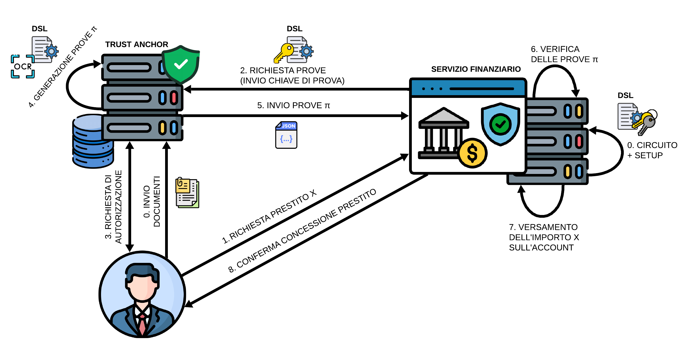

# Description
This repository contains the code for a master's course project in Data Security.
The project focuses on leveraging Zero-Knowledge Proof (ZKP) technology for the selective disclosure of financial information in the Know Your Customer (KYC) process.

## System architecture

